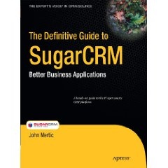

[The Definitive Guide to SugarCRM: Better Business Applications](http://www.amazon.com/gp/product/1430224398?ie=UTF8&tag=johmer-20&linkCode=as2&camp=1789&creative=9325&creativeASIN=1430224398) is the book I have been working on this year, which offers a unique insight into the SugarCRM platform from me as a engineer at Sugar. I go into details on the nuts and bolts of how things work: MVC, metadata, web services, and more, and then show how to extend the platform to meet any organizations needs. In the end, the book really shows the power of SugarCRM to fit into any business as a more than just a CRM, but more as a platform for application development. It's also special because it's the only SugarCRM book on the market that is an official book for SugarCRM, bearing the company logo on the cover.

The book is available on Amazon using the link above.
