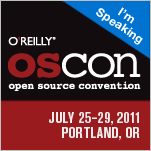

I'm excited to announce I'll be back speaking at [OSCON](http://www.oscon.com/) this summer with a new talk, "[Making Your PHP Application Easy to Customize](http://www.oscon.com/oscon2011/public/schedule/detail/17936)". This talk will center around the types of strategies we done at SugarCRM to make it very customizable, giving you tips you can take back with you.

OSCON is one of my favorite conferences to be a part of ( mostly because of the great city of Portland that hosts it ) and one that anyone interested in Open Source and technology should be a part of. O'Reilly has given me a special code to use during registration that will give you a 20% discount, just enter "Mertic" as the discount code in the [registration form](https://en.oreilly.com/oscon2011/public/register) to receive this discount.
